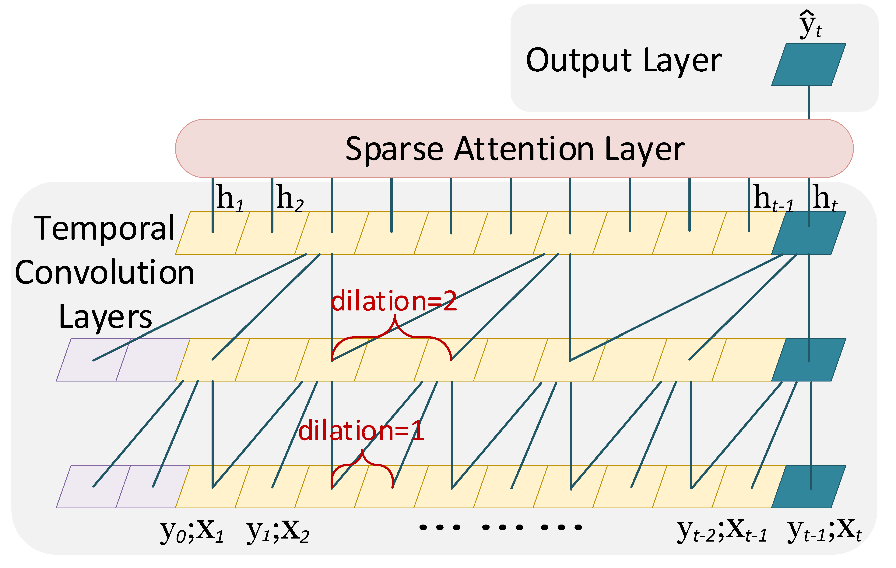

# TCAN

Author: [Yang Lin](https://yanglin1997.github.io/)

E-mail: linyang1997@yahoo.com.au

===========================================================================

A **PyTorch** implementation of **TCAN (IJCNN 2021)**.

<div style="text-align:center"></div>

## Abstract
<p align="justify">
Temporal Convolutional Neural Networks (TCNNs) have been applied for various sequence modelling tasks including time series forecasting. However, TCNNs may require many convolutional layers if the input sequence is long and are not able to provide interpretable results. In this paper, we present TCAN, a novel deep learning approach that employs attention mechanism with temporal convolutions for probabilistic forecasting, and demonstrate its performance in a case study for solar power forecasting. TCAN uses the hierarchical convolutional structure of TCNN to extract temporal dependencies and then uses sparse attention to focus on the important timesteps. The sparse attention layer of TCAN enables an extended receptive field without requiring a deeper architecture and allows for interpretability of the forecasting results. An evaluation using three large solar power data sets demonstrates that TCAN outperforms several state-of-the-art deep learning forecasting models including TCNN in terms of accuracy. TCAN requires less number of convolutional layers than TCNN for an extended receptive field, is faster to train and is able to visualize the most important timesteps for the prediction.</p>

This repository provides an implementation for TCAN as described in the paper:

> Temporal Convolutional Attention Neural Networks for Time Series Forecasting.
> Yang Lin, Irena Koprinska, Mashud Rana
> IJCNN, 2021.
> [[Paper]](https://www.researchgate.net/profile/Yang-Lin-27/publication/354797495_Temporal_Convolutional_Attention_Neural_Networks_for_Time_Series_Forecasting/links/61558599ab3c1324134c8883/Temporal-Convolutional-Attention-Neural-Networks-for-Time-Series-Forecasting.pdf)

**Citing**

If you find TCAN and the new datasets useful in your research, please consider adding the following citation:

```bibtex
@inproceedings{Yang21TCAN,
              author    = {Yang Lin and Irena Koprinska and Mashud Rana},
              title     = {Temporal Convolutional Attention Neural Networks for Time Series Forecasting},
              year      = {2021},
              booktitle = {Proceedings of the IEEE International Joint Conference on Neural Networks (IJCNN)},
}
```

## List of Implementations:

Sanyo: http://dkasolarcentre.com.au/source/alice-springs/dka-m4-b-phase

Hanergy: http://dkasolarcentre.com.au/source/alice-springs/dka-m16-b-phase

Solar: https://www.nrel.gov/grid/solar-power-data.html


## To run:

1. Preprocess the data:
  
   ```bash
   python preprocess_Sanyo.py
   python preprocess_Hanergy.py
   python preprocess_solar.py
   ```

2. Restore the saved model and make prediction:
   
   ```bash
   python train.py --dataset='Sanyo' --model-name='base_model_Sanyo' --restore-file='best'
   python train.py --dataset='Hanergy' --model-name='base_model_Hanergy' --restore-file='best'
   python train.py --dataset='Solar' --model-name='base_model_Solar' --restore-file='best'
   ```

3. Train the model:
  
   ```bash
   python train.py --dataset='Sanyo' --model-name='base_model_Sanyo' 
   python train.py --dataset='Hanergy' --model-name='base_model_Hanergy'
   python train.py --dataset='Solar' --model-name='base_model_Solar' 
   ```
